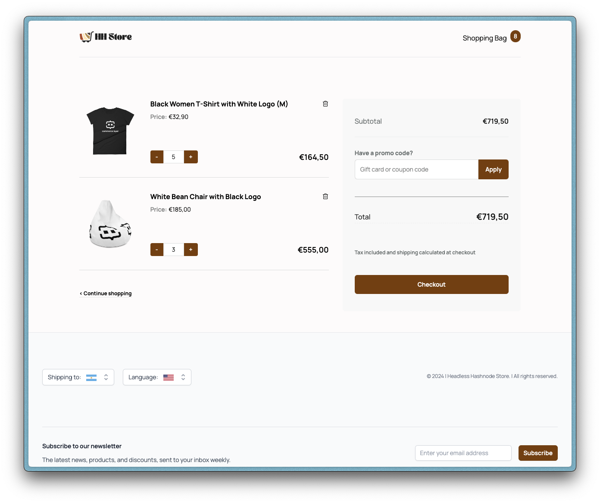
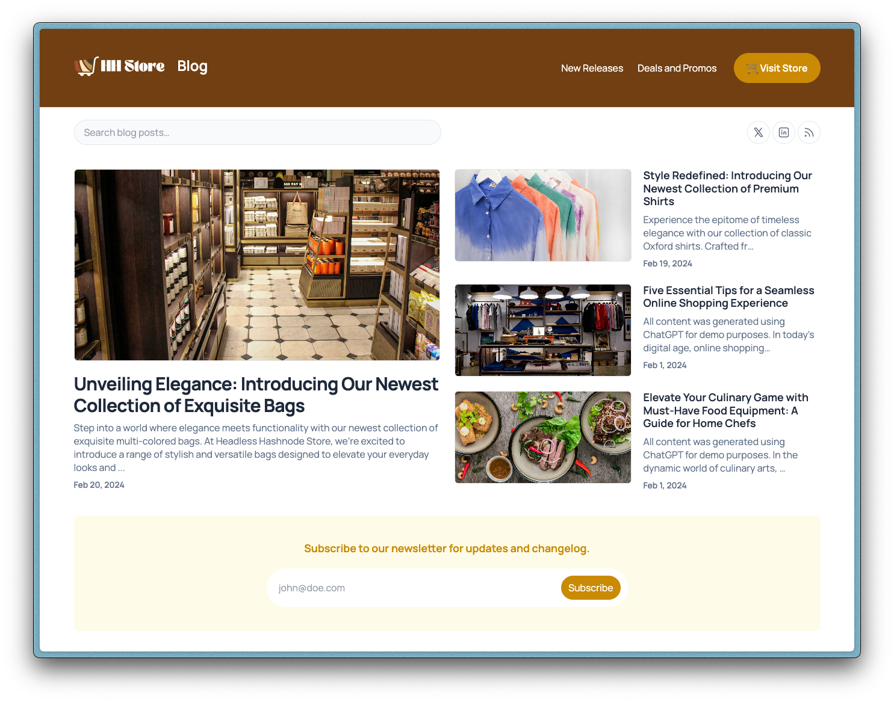
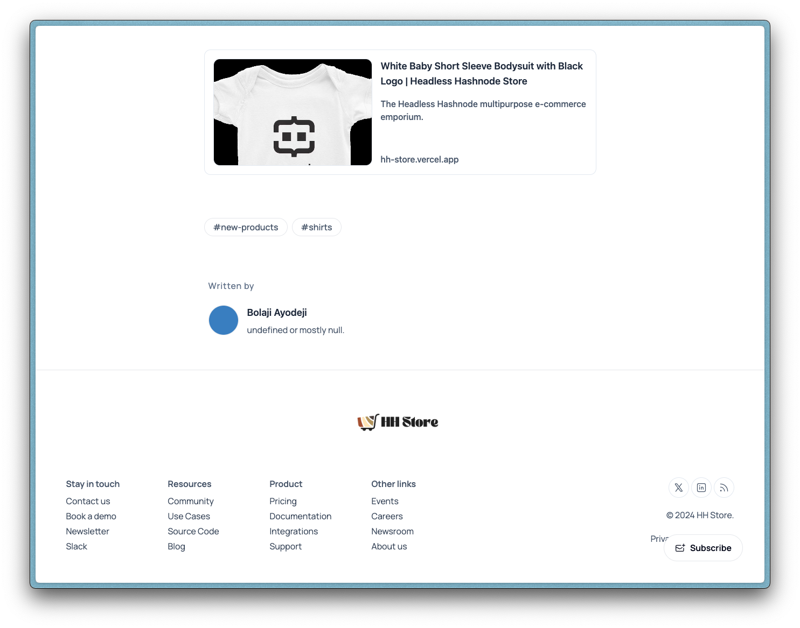

# Headless Hashnode Store

A demo of a fully functional e-commerce store and blog for this [Integrating Headless Hashnode with E-commerce Platforms for Content-Driven Commerce](#) tutorial.

[](https://hashnode.com/headless?utm_source=bolajiayodeji)

---

## Getting Started

> [!NOTE]
> 
> To run this project locally, install all dependencies using the `pnpm install` command and add all the required environmental variables using the `.env.example` files.

<br />

The store is built with [commercelayer-sanity-template](https://github.com/commercelayer/commercelayer-sanity-template) (live demo: <https://hh-store.vercel.app>), and the code is located in `packages/ecommerce-store`, so run the command below to start it up:

```bash
cd packages/ecommerce-store && pnpm run dev
```

The blog is built with Hashnode's [starter-kit](https://github.com/Hashnode/starter-kit) (live demo: <https://hh-store.vercel.app/blog>), and the code is located in `packages/hashnode-blog`, so run the command below to start it up:

```bash
cd packages/hashnode-blog && pnpm run dev
```

✅ That's all! This will run the store at `localhost:3000`, content studio at `localhost:3000/studio`, and blog at `localhost:3000/studio`.

## Store Preview




## Blog Preview




